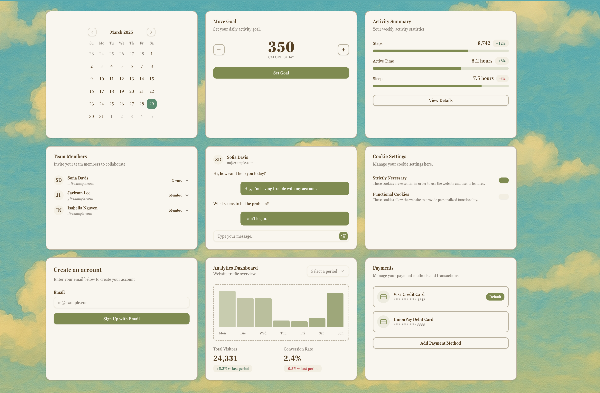

# Ghibli Styled shadcn/ui

A Ghibli-inspired UI theme built with [shadcn/ui](https://ui.shadcn.dev/) for Next.js apps. Soft colors, dreamy details — perfect for calm and elegant interfaces.

<div align="center">
  
</div>

## Tech Stack

-  Next.js 15
-  shadcn/ui
-  Tailwind CSS
-  TypeScript

## 🚀 Quick Start

```bash
git clone https://github.com/cefeng06/Ghibli-Shadcn-Theme.git
cd Ghibli-Shadcn-Theme
pnpm install
pnpm run dev
```

## 🌟 Contribute
Pull requests are welcome!
Let’s make it even more Ghibli!
