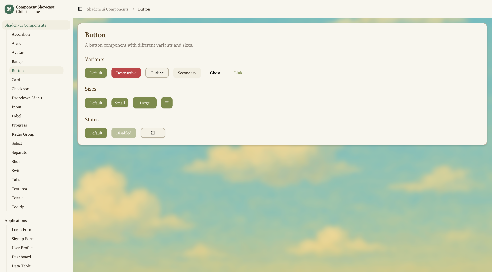
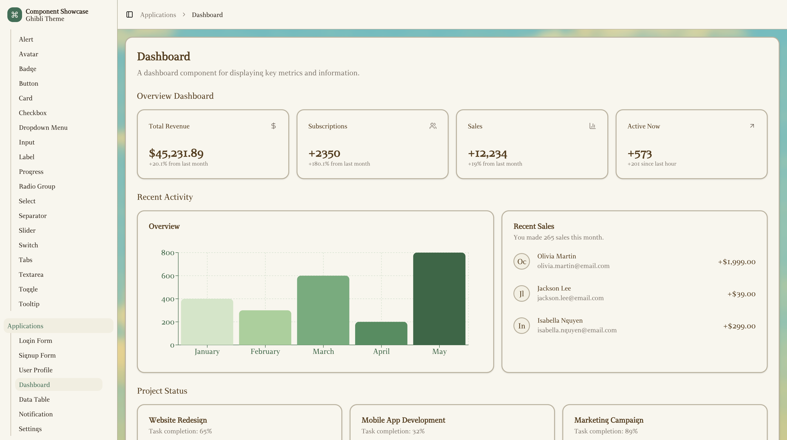

# 吉卜力风 Shadcn/ui 主题

[English](README.md) | [中文](README.zh.md)

[**立即体验**](https://ghibli-shadcn-theme.vercel.app/)

一个吉卜力风格的 UI 主题，基于 [shadcn/ui](https://ui.shadcn.dev/) 为 Next.js 应用打造。

<div align="center">
  
</div>

<div align="center">
  
</div>

## 技术栈

- Next.js 15
- shadcn/ui
- Tailwind CSS
- TypeScript

## 🚀 快速开始

```bash
git clone https://github.com/cefeng06/Ghibli-Shadcn-Theme.git
cd Ghibli-Shadcn-Theme
pnpm install
pnpm run dev
```

## 🌟 贡献
欢迎提交样式建议，看起来更加吉卜力！ 
